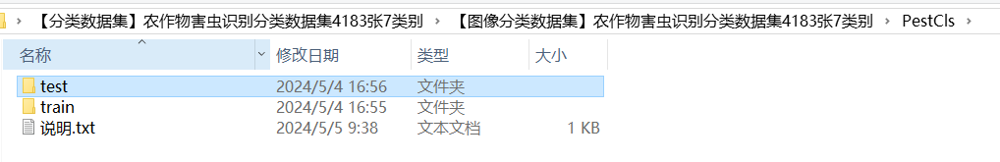
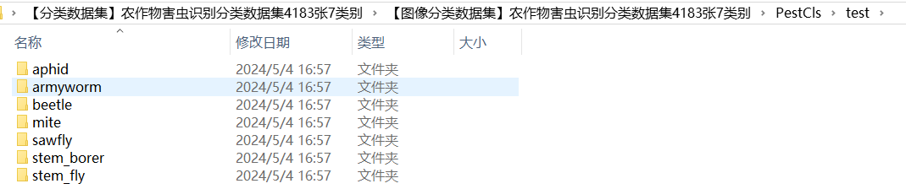
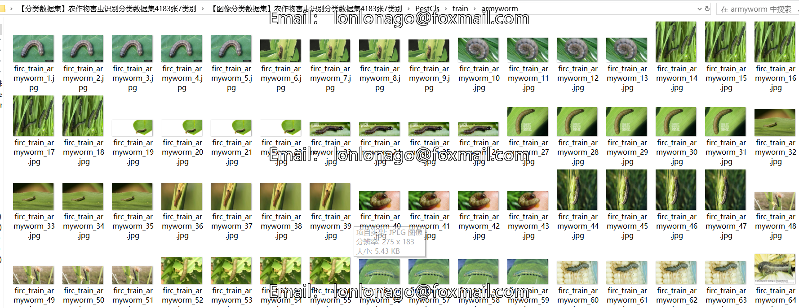
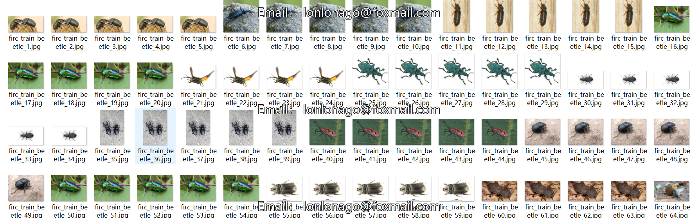

# [Classification Dataset] Crops Pest Recognition Classification Dataset
4183 images, 7-class

Dataset Description: ~

Dataset Type: Images for image classification, not suitable for target detection with no labeled files (download and manually label using labelImg if needed).

Dataset Format: Only contains jpg images, each category folder contains the corresponding images.

Number of Images (JPG Files): 4183

Number of Categories: 7

Category Names: ["aphid", "armyworm", "beetle", "mite", "sawfly", "stemborder", "stemfly"]

Number of Images per Category:

- aphid images: 1299
- armyworm images: 350
- beetle images: 350
- mite images: 1200
- sawfly images: 350
- stemborer images: 50
- stemfly images: 50
- stemborder images: 300
- stemfly images: 234

Important Notice: No guarantee made on the accuracy or reasonable classification of the trained models or weights file. The dataset only provides accurate and reasonable classification storage.

## Images

---

Here is a pay link on Stripe (https://buy.stripe.com/3cs8yP7sY87d0vu9AB). Please contact me lonlonago@foxmail.com after funding $89, and I will send you a complete data files, thank you!

